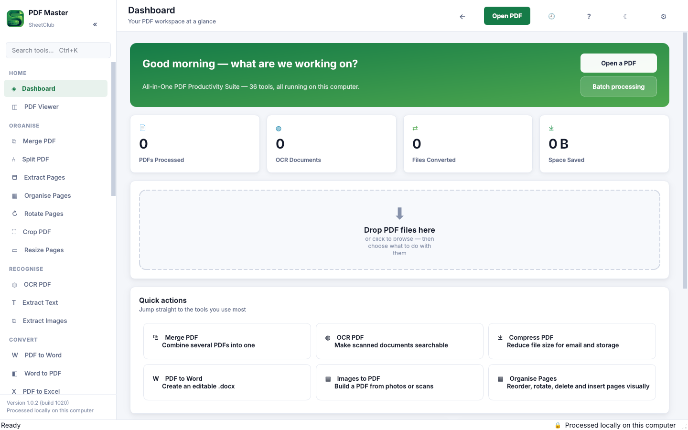
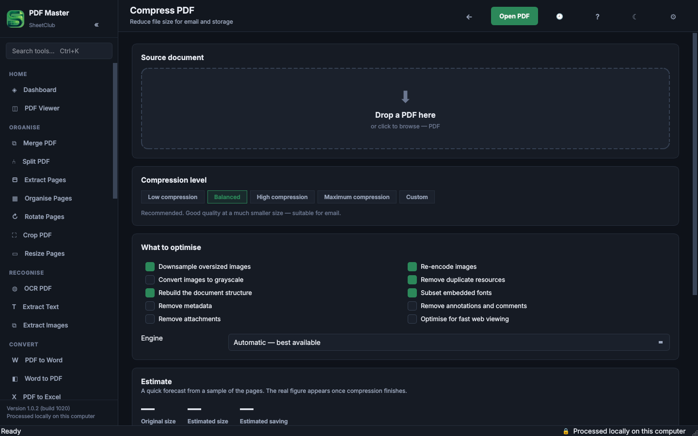
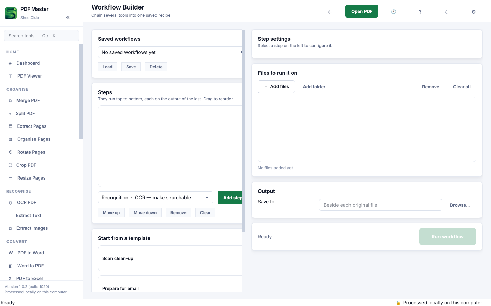

# PDF Master Toolkit

An all-in-one PDF desktop suite for Windows 10 and 11, built with Python and Qt. It bundles 30+ PDF tools in one app, and everything runs locally on your computer, so documents never leave the machine.



## Features

| Group | Tools |
|---|---|
| Organise | Merge, Split, Extract Pages, Organise Pages, Rotate, Crop, Resize Pages |
| Recognise | OCR PDF, Extract Text, Extract Images |
| Convert | PDF to and from Word, Excel and images |
| Edit | Watermark, Header and Footer, Page Numbers, Sign, Redact |
| Secure | Protect, Unlock, Metadata |
| Optimise | Compress, Repair, Compare |
| Capture | Scan to PDF |
| Automate | Batch Processing, Workflow Builder, Visit Sorter |
| Plus | Dashboard, PDF Viewer, History, Settings |

### OCR

Each page is rendered, cleaned up (deskew, auto-rotate, denoise, contrast, binarise) and read with Tesseract. The recognised words are written back onto the original page as an invisible text layer, so the file looks identical to the scan but becomes searchable and copyable. Several languages can be recognised together, for example English and Bengali.

### Visit Sorter

Detects visit sets in large scanned care-documentation PDFs, exports them to Excel for review, rebuilds the file in date order and splits it into size-capped parts without breaking a visit across files.

## Screenshots

| Compress (dark theme) | Workflow Builder |
|---|---|
|  |  |

## Design

- **Responsive on big jobs.** Every operation runs in a thread pool with shared progress, logging, pause and cancel, so a 3,000-page OCR run is as cancellable as a two-page merge.
- **Fast viewer.** Only the visible pages are rendered into a bounded cache, so a 2,000-page document opens as quickly as a 5-page one.
- **Honest results.** Compression that cannot shrink a file says so, repair reports lost pages as well as recovered ones, and redaction is verified by searching the finished file.
- **Safe output.** Originals are never overwritten without an explicit confirmation; new files are named document_ocr.pdf, document_ocr_2.pdf and so on.
- **Easy to extend.** A new tool is one page module plus one registry line; the sidebar, search, dashboard, batch and workflow features pick it up automatically.
- **One-file branding.** app/branding.py controls the name, colours, About page and installer metadata.

## Project layout

```
app/
  branding.py  theme.py  paths.py  config.py  db.py
  core/        PDF engines (OCR, compress, convert, redact, security, workflow ...)
  ui/          main window, sidebar, viewer, organiser and one module per screen
tools/         asset generation and vendor staging scripts
installer/     Inno Setup script
tests/         encryption regression tests
build.bat      one-click Windows build
```

## Running and building

| Task | How |
|---|---|
| Run from source | Double-click run_dev.bat (Python 3.11+) |
| Build the installer | Double-click build.bat with Python 3.11+ and Inno Setup 6 installed |
| Details | See [BUILDING.md](BUILDING.md), including bundling the OCR engine |

Scan to PDF needs a WIA scanner driver, and certificate signing needs the optional pyHanko component. Every other tool works offline with no extra setup.

## Tech stack

Python, PySide6 (Qt), PyMuPDF, pypdf, Tesseract OCR, pdf2docx, pdfplumber, openpyxl, Pillow, PyInstaller, Inno Setup.

## Author

Built by Sourab Kumar Saha for [SheetClub](https://sheetclubofficial.com). Available for custom automation and desktop tools on [Fiverr](https://www.fiverr.com/spontaneoussrv).
